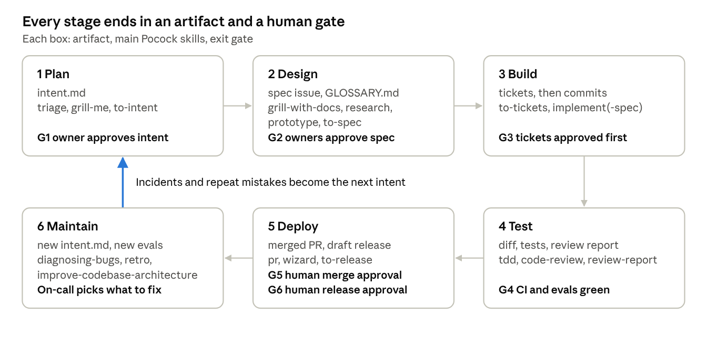

# AI-Native SDLC with Matt Pocock Skills

Oct 2, 2026 · Dorin

## Summary

This SDLC uses Anthropic's six-stage loop (Plan, Design, Build, Test, Deploy, Maintain) as the skeleton and Matt Pocock's skills as the working method inside each stage. Anthropic supplies the governance: a versioned artifact per stage, hooks that block what must never happen, evals, and humans at every approval gate. Pocock supplies the engineering discipline: grilling before building, tracer-bullet tickets, TDD at agreed seams, two-axis code review, PR bodies written for human reviewers, session retros, and regular architecture cleanup.

Five rules hold the whole thing together:

1. **Every stage ends in a committed artifact.** intent.md, spec issue, tickets, diff with tests, merged PR. The artifact chain is the audit trail.
2. **Humans decide, Claude executes.** A person approves intent, spec, plan, merge and release; Claude drafts, builds, verifies and fixes.
3. **Skills advise, hooks enforce.** Pocock's skills shape how Claude works. Anything that must hold without exception is backed by a hook or branch protection.
4. **Claude verifies its own work before a human sees it.** Typecheck, tests, full suite and /code-review run before a PR is opened.
5. **The loop closes.** Incidents and repeated review mistakes become new intents, evals and CLAUDE.md rules.

## What each source contributes

The two sources barely overlap: Anthropic defines the stages, artifacts and gates, and Pocock defines how the work inside a stage is done.

|  | [Anthropic AI-Native SDLC Playbook](https://claude.com/blog/the-ai-native-sdlc-playbook) | [mattpocock/skills](https://github.com/mattpocock/skills) |
| --- | --- | --- |
| Answers | What happens in which stage, who approves, how it is enforced | How Claude should think and work while doing a task |
| Core unit | Stage plus versioned artifact (intent.md, spec.md, plan.md) | Skill invoked by the user or the model |
| Control | Hooks, managed settings, branch protection, REVIEW.md, evals in CI | Prompts that impose discipline (grilling, TDD, two-axis review) |
| Human role | Owns intent, approves gates, governs the loop | Answers the grilling, picks tickets, reviews output |
| Gap it leaves | Says little about engineering craft inside Build | No gates, no enforcement, no deploy or ops stage |

Anthropic's [security write-up](https://claude.com/blog/how-anthropic-secures-its-ai-native-software-development-lifecycle) adds risk tiering of the codebase, /security-review during coding, sandboxed agents with egress allowlists, and logging of every automated approval. Pocock's skills are installed with `npx skills@latest add mattpocock/skills` followed by a one-time `/setup-matt-pocock-skills` per repo, which configures the issue tracker, triage labels and doc locations. This version reflects Pocock's [v1.3 release](https://www.aihero.dev/skills-changelog-v13-implement-spec-pr-retro-and-glossary-md), which renamed CONTEXT.md to GLOSSARY.md, added implement-spec, pr and retro, and removed resolving-merge-conflicts.

## The six stages

Each stage starts from the previous stage's artifact and ends at a gate a human owns. Claude does the drafting and execution in every stage; the human's job is to sharpen intent and say yes or no at the gate.



Work flows clockwise; Maintain feeds new intents back into Plan, so the loop never ends at deploy.

| Stage | Human does | Claude does | Pocock skills | Artifact | Exit gate |
| --- | --- | --- | --- | --- | --- |
| 1. Plan | Writes the ask in their own words; decides if it is worth doing | Triages inbound issues, interviews the requester until the intent is unambiguous | triage, grill-me, wait-what, to-questionnaire, then to-intent (team skill) to save the result | `specs/<slug>/intent.md` | **G1** Product owner approves intent |
| 2. Design | Answers the grilling; settles trade-offs; policy owners review risky areas | Builds the domain model, researches, prototypes the open questions, writes the spec | grill-with-docs, domain-modeling, research, prototype, codebase-design, to-spec | Spec issue in the tracker, linked from intent.md; updated `GLOSSARY.md` | **G2** Owner approves spec; security or compliance owner signs if risk tier is high |
| 3. Build | Corrects the ticket plan before code; runs 2 to 3 sessions in parallel | Splits the spec into tracer-bullet tickets, then implements one ticket per session with TDD | to-tickets (or wayfinder for multi-week work), implement per ticket, or implement-spec for a whole low-risk spec, tdd, diagnosing-bugs, handoff | Tickets with blocking edges (this is Anthropic's plan.md), then commits | **G3** Engineer approves tickets before the first line of code |
| 4. Test | Reviews only what survived automated checks | Runs typecheck, single tests, full suite, two-axis /code-review, /security-review, evals | tdd, code-review, then review-report (team skill) to save the result | Test files in the diff, CI test and coverage reports, review report comment on the PR | **G4** CI green, evals pass, no open Important findings |
| 5. Deploy | Code owner approves the merge; release owner approves production | Writes the PR body with pr (Summary, Evidence, Merge Danger), addresses review comments, writes wizards for manual steps | pr, wizard, then to-release (team skill) for the release record | Merged PR with review report and approval; draft GitHub Release from to-release; deployment record from CI | **G5** Human merge approval (the authoring agent can never approve). **G6** Release approval for production |
| 6. Maintain | On-call triages findings; decides which become work | Diagnoses incidents, files new intents, runs retro after reviews and bug fixes, scans for architecture decay every few days | diagnosing-bugs, retro, improve-codebase-architecture, triage | New `intent.md`, new evals, CLAUDE.md rules | Loops back to G1 |

Two Pocock skills sit outside the stages. **handoff** compacts a session into a document so the next session can continue a ticket. **ask-matt** routes to the right skill when nobody remembers which one fits.

### How the Plan and Design artifacts get written

Neither grill-me nor to-spec writes a repo file. grill-me only runs the interview, and to-spec publishes the spec as an issue in your tracker with the ready-for-agent label. So the two artifacts are produced like this:

1. **intent.md:** after grill-me ends, run **to-intent**, a small team skill you add next to Pocock's. Like to-spec, it does not interview; it condenses the conversation into `specs/<slug>/intent.md` and opens a PR. Merging that PR is G1.
2. **Spec:** run grill-with-docs, then to-spec. The spec lives in the tracker, and the intent.md PR links to it. The product owner applying ready-for-agent is G2.

Keeping the spec in the tracker follows the playbook's advice to name one system of record per artifact, and it is where to-tickets and code-review already look.

### How Build runs: implement or implement-spec

Pocock's v1.3 offers two ways to build an approved ticket plan, and the risk tier decides which one to use:

1. **implement, one ticket per session.** Each ticket gets its own branch and PR. This is the default for medium and high risk tiers, because each PR stays small enough for a human to review at G5.
2. **implement-spec, the whole spec in one run.** Claude creates an integration branch, explores the code, then runs one subagent per ticket in the order the blocking edges allow, merges them and runs /code-review on the whole branch. Use it for low-risk specs with a handful of tickets.

implement-spec produces one large branch, so its PR is harder to review and its merge conflicts land at the end. Keep it out of auth, payments and data-deletion code, and split a spec rather than let one PR grow past what a code owner can review in one sitting.

### How the Test artifacts get written

Pocock's tdd writes test files, but code-review and /security-review only report in chat. Stage 4 therefore keeps three artifacts:

1. **Tests:** the test files tdd writes are committed in the diff. The test plan they follow is the Testing Decisions section of the spec issue that to-spec writes.
2. **Test run:** CI saves a JUnit XML and coverage report with every build, and the PR links to them.
3. **Review report:** run **review-report**, a second team skill. It runs typecheck, the full suite, /code-review and /security-review, then posts one PR comment with the G4 checklist, the tests added, findings ranked Important or Nit, and a verdict. A rerun edits the same comment, and the skill never approves the PR.

The report is a PR comment rather than a repo file, so it sits next to the diff it judges and adds no file to every PR.

### How the Deploy artifacts get written

Deploy has two gates, and each leaves a record:

1. **G5 merge:** the merged PR is the artifact. It carries the PR body Pocock's pr skill writes (Summary, Evidence with a before and after, and Merge Danger: how reversible the change is and its blast radius), the review report, the human approval and the CI results.
2. **G6 release:** run **to-release**, a third team skill. It drafts a release record for each production deploy and saves it as a draft GitHub Release. The record lists every PR that ships with its intent, spec, risk tier, approver and review verdict. It also flags PRs missing an approval or a Ready report, lists risky changes, starting from each PR's Merge Danger section, with a rollback for each, and links a wizard script for manual steps.
3. **Deploy log:** CI deploys through the production GitHub environment, which records each deploy against its commit and waits for the release owner's approval.

The release owner reads the draft, approves the production environment, then publishes the release. The skill never deploys, publishes or approves anything.

### How Maintain improves the environment

Pocock's retro closes the loop Anthropic describes, where a mistake seen twice becomes a CLAUDE.md rule. Run it after each review report and after each diagnosing-bugs fix. It looks at the session, not the code, and proposes changes to CLAUDE.md, coding standards, automatable checks and tooling. It changes nothing on its own: the SDLC steward decides which proposals to apply, and an applied change to CLAUDE.md, a skill or a hook reruns the evals before it merges.

## Skill-to-stage map

Every skill in Pocock's v1.3 release has a home, plus our three team skills; only teach is optional. resolving-merge-conflicts was removed in v1.3 because conflicts are now handled by the harness. "User" skills are run as slash commands; "Model" skills Claude picks up on its own.

| Skill | Stage | Invoked by | Use it when |
| --- | --- | --- | --- |
| setup-matt-pocock-skills | Setup | User | Once per repo, to point skills at the tracker, labels and docs folders |
| ask-matt | Any | User | You are unsure which skill fits |
| triage | 1 Plan, 6 Maintain | User | Moving inbound issues through triage states |
| grill-me / grilling | 1 Plan | User / Model | The ask is vague; Claude interviews until every branch is resolved. Writes no file, so run to-intent next |
| to-intent | 1 Plan | Team skill | Saving the grilled ask as specs/SLUG/intent.md and opening the G1 PR |
| wait-what | 1 Plan | User | A stakeholder message is unclear; re-pitch it in plain words using GLOSSARY.md terms |
| to-questionnaire | 1 Plan, 2 Design | User | A decision needs async input from people not in the session |
| grill-with-docs | 2 Design | User | Aligning on requirements while updating GLOSSARY.md |
| domain-modeling | 2 Design | Model | Terms are fuzzy or overloaded, or someone edits GLOSSARY.md |
| research | 2 Design | Model | A question needs primary sources and a cited answer |
| prototype | 2 Design | Model | A design question is cheaper to answer with throwaway code |
| codebase-design | 2 Design, 3 Build | Model | Choosing seams and module boundaries; these become the TDD seams |
| to-spec | 2 Design | User | Turning the design discussion into a spec issue in the tracker, labelled ready-for-agent |
| to-tickets | 3 Build | User | Turning the spec issue into tracer-bullet tickets with blocking edges |
| wayfinder | 3 Build | User | Work spans many sessions and needs a decision map |
| implement | 3 Build | User | Building one ticket; it drives tdd and code-review. Default for medium and high risk tiers |
| implement-spec | 3 Build | User | Building a whole low-risk spec in one run on an integration branch, with subagents per ticket and one /code-review at the end |
| tdd | 3 Build, 4 Test | Model | Writing code at an agreed seam, red-green-refactor |
| diagnosing-bugs | 3 Build, 6 Maintain | Model | Anything is broken: reproduce, minimise, hypothesise, instrument, fix. Follow with retro |
| handoff | 3 Build | User | Ending a session mid-ticket |
| code-review | 4 Test | Model | Before every PR: Standards axis and Spec axis. Output stays in chat, so review-report runs it and saves the result |
| review-report | 4 Test | Team skill | Posting the G4 review report on the PR |
| pr | 5 Deploy | Model | Writing the PR body: Summary, Evidence (before and after), Merge Danger |
| wizard | 5 Deploy | Model | A release has manual steps a human must run; to-release calls it |
| to-release | 5 Deploy | Team skill | Drafting the G6 release record as a draft GitHub Release |
| retro | 6 Maintain | User | After code-review or a bug fix: finds what in CLAUDE.md, checks or tooling would have prevented the friction. Proposes only |
| improve-codebase-architecture | 6 Maintain | User | Every few days, to catch entropy before it compounds |
| writing-for-agents | Setup | Model | Writing CLAUDE.md, REVIEW.md and skills |
| teach | Optional | User | Onboarding a person onto the codebase |

## Roles for a 10-developer team

With 10 developers, every gate keeps a separate human owner, but most roles are hats the developers wear on a rotation rather than new hires. The one structural rule: the person who drove Claude on a change never gives that change its G5 approval.

| Role | Held by | Gates | Notes |
| --- | --- | --- | --- |
| Product owner | Product manager, or the tech lead if there is none | G1, G2 | Approves intent.md and the spec issue for every feature |
| Feature driver | Any developer, one per feature | G3 | Runs the grilling, approves tickets, steers 2 to 3 Claude sessions |
| Code owners | 2 to 3 developers per area in CODEOWNERS | G5 | Approve merges for areas they do not author in that change |
| Policy owners | One developer each for security and for data or compliance | G2 on high-risk specs | Also own the matching policy skill and hooks |
| Release owner | Weekly rotation | G6 | Approves production deploys and runs any wizard steps |
| On-call | Weekly rotation, can be the same person as release owner | Maintain | Triages monitoring findings and turns the real ones into intent.md |
| SDLC steward | One developer, rotating monthly | None | Owns CLAUDE.md, REVIEW.md, evals and hooks; reviews eval pass rates, samples automated approvals, and decides which retro proposals to apply |

Plan for review becoming the bottleneck. Ten developers running 2 to 3 sessions each can open 20 or more PRs a day, so keep PRs to one tracer-bullet ticket each, let Claude's review clear the Nits before a human looks, and reserve human review time each day rather than reviewing between tasks.

## Gates and controls

A gate passes only on a human decision or a deterministic check, never on a skill's say-so. Skills tell Claude how to work well; hooks, branch protection and CI make the non-negotiables hold.

| Gate | Passes when | Who decides | Enforced by |
| --- | --- | --- | --- |
| G1 Intent | intent.md states the problem, who has it and what done looks like, in the requester's words | Product owner | PR to `specs/` with CODEOWNERS on that folder |
| G2 Spec | The spec issue is approved; GLOSSARY.md is updated; high-risk areas signed by their policy owner | Product owner, plus security or compliance owner by risk tier | Only the product owner may apply the ready-for-agent label; risk tier label |
| G3 Plan | Tickets are thin vertical slices with blocking edges and named TDD seams | Engineer | Tickets moved to Ready in the tracker |
| G4 Verified | Typecheck, full suite and evals green; /code-review and /security-review have no open Important findings; the review report says Ready for human review | CI | Required status checks |
| G5 Merge | A human code owner approves; Claude's review informs but never approves | Code owner | Branch protection, required reviewers |
| G6 Release | Release owner has checked the to-release draft and approves the production environment | Release owner | Deploy hook or environment protection rule |

Controls that run all the time:

- **Hooks** block edits to protected paths (migrations, generated code, secrets, CI config), run the formatter after every edit, and stop pushes to main.
- **Managed settings** fix permissions and sandboxing so an engineer cannot loosen them per session. Agents run with an egress allowlist.
- **Risk tiers** decide how much autonomy each area gets: dev deploys autonomously, staging is mixed, production always needs G6. Auth, payments and data-deletion paths always need a human reviewer at G5.
- **REVIEW.md** defines what Claude's PR review checks for and how it ranks severity (Important vs Nit). Pocock's code-review reads `CODING_STANDARDS.md` for its Standards axis and the issue referenced in commit messages (or a path you give it) for its Spec axis, so keep standards in the repo and reference the spec issue in every commit.
- **Evals**: 20 to 50 real past tasks, rerun in CI whenever CLAUDE.md, a skill or a hook changes. A config change that drops the pass rate does not merge.
- **Audit**: the artifact chain plus logged automated approvals; sample a few automated approvals each week.

## Repo setup

One repo layout serves both sources: the artifacts Anthropic asks for live where Pocock's skills already look for them.

```
CLAUDE.md                  # conventions, commands, mistakes Claude made twice
GLOSSARY.md                # domain language, kept current by grill-with-docs
CODING_STANDARDS.md        # Standards axis for /code-review
REVIEW.md                  # what Claude's PR review checks and how it ranks severity
specs/<slug>/intent.md     # Stage 1, written by to-intent, approved at G1
evals/                     # 20 to 50 real past tasks
.claude/settings.json      # hooks and permissions
.claude/skills/            # Pocock skills plus to-intent, review-report, to-release and your policy skills
.github/CODEOWNERS         # owners for specs/, auth, payments, infra
```

The spec is not a repo file: to-spec publishes it as a tracker issue, and to-tickets and code-review read it from there.

Setup checklist:

- [ ] Install the skills: `npx skills@latest add mattpocock/skills`, then run `/setup-matt-pocock-skills`
    - [ ] Use Pocock's skills v1.3 or later (`npx skills update`), which name the glossary GLOSSARY.md. An older repo migrates with `git mv CONTEXT.md GLOSSARY.md`, and any leftover resolving-merge-conflicts folder is deleted
- [ ] Add the to-intent team skill to `.claude/skills/to-intent/` (intent files go in `specs/`); the tracker configured by /setup-matt-pocock-skills holds specs and tickets
- [ ] Write CLAUDE.md with build, test and typecheck commands, using writing-for-agents
- [ ] Write CODING_STANDARDS.md and REVIEW.md
- [ ] Add an intent.md template under `specs/_template/`
- [ ] Add hooks: block protected paths, format on edit, block pushes to main
- [ ] Turn on branch protection with required CI checks and a required code owner review
- [ ] Add the review-report team skill, Claude PR review in CI (Claude Code GitHub Action or Code Review), and JUnit XML plus coverage uploads as CI build artifacts. Deploy through a GitHub environment named production with required reviewers, so every deploy is recorded and waits for G6
- [ ] Collect the first 20 eval tasks from recently merged PRs and run them in CI
- [ ] Label risk tiers in CODEOWNERS and the deploy pipeline

## Rollout and metrics

Roll it out in Anthropic's four steps, starting wherever work stalls today: slow reviews mean start at Deploy, vague asks mean start at Plan.

1. **Manual loop.** Run the stages by hand on one real feature: grill-me, to-spec, to-tickets, implement. Save intent.md with to-intent and publish the spec issue with to-spec. Write CLAUDE.md and GLOSSARY.md as you go.
2. **Enforcement.** Add Claude PR review against REVIEW.md, the protected-path and production hooks, branch protection, and your first policy skill (for example a secure-API skill).
3. **Automation.** Let a committed intent.md or a spec issue labelled ready-for-agent kick off the next stage. Run 2 to 3 parallel sessions per engineer, one ticket each. Turn on evals in CI.
4. **Closed loop.** Monitoring opens intent.md files on its own, incidents become evals, improve-codebase-architecture runs on a schedule, and retro runs after every review and bug fix.

Measure each stage with one leading and one lagging number, taken from the playbook:

| Stage | Leading | Lagging |
| --- | --- | --- |
| Plan | Hours from ask to committed intent.md | Share of approved intents that ship |
| Design | Hours from intent.md to approved spec issue | Rework after build starts |
| Build | First-pass merge rate | Diff still matches the tickets |
| Test | First-pass CI success rate | Defects that reach production |
| Deploy | Minutes to first review | Vulnerabilities found after merge vs before |
| Maintain | Minutes from incident to intent.md | Repeat incidents |

Add one maintenance number the playbook leaves out: the share of merged PRs that are refactors from improve-codebase-architecture. If it falls toward zero, entropy is winning.
